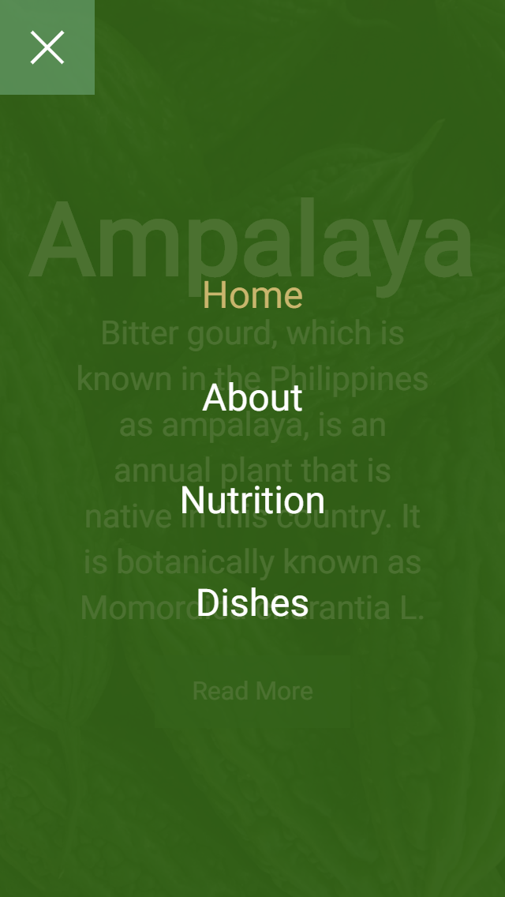
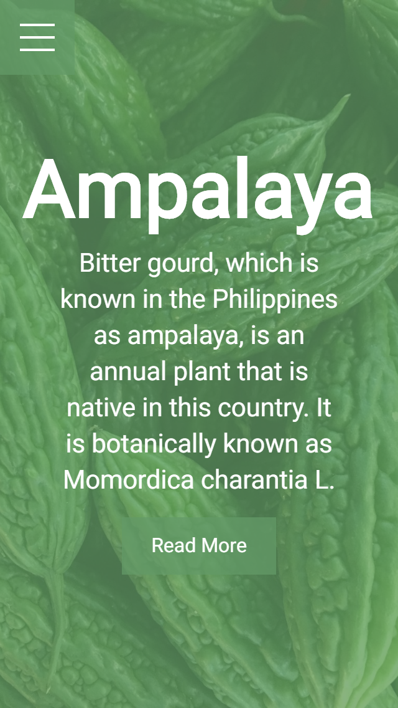
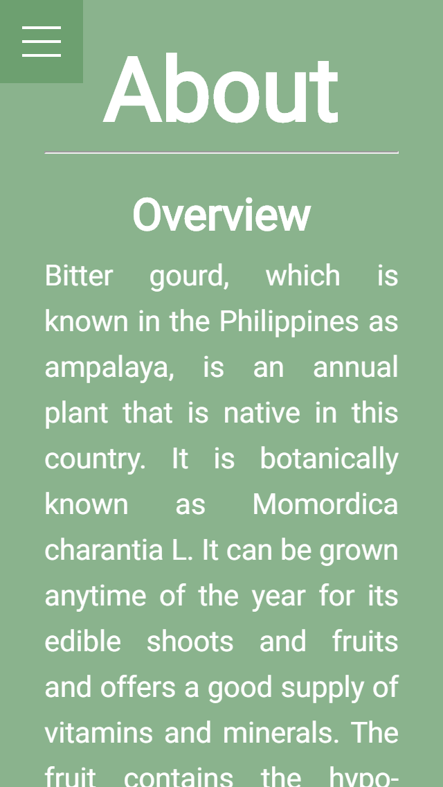
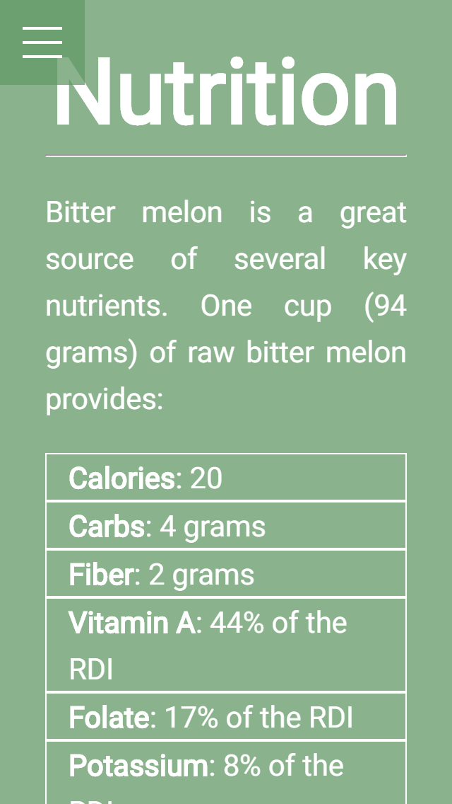
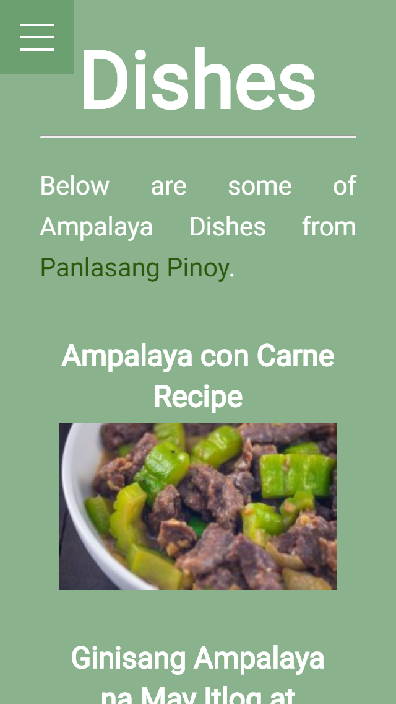

# Ampalaya
A website for the basic information about Ampalaya.

Go now to [Ampalaya](https://ampalaya-mrg.netlify.com) website to view it.

## Objective
* Creating menu bar overlay using html and css

## Preview
|   Desktop   |   Mobile    |
| ----------- | ----------- |
|  |  |
|  |  |
|  |  |
|  |  |
|  |  |

## Color Palette
* white: `#ffffff`
* light-green: `#639a67`
* dark-green: `#2b580c`
* light-brown:`#d9bf77`